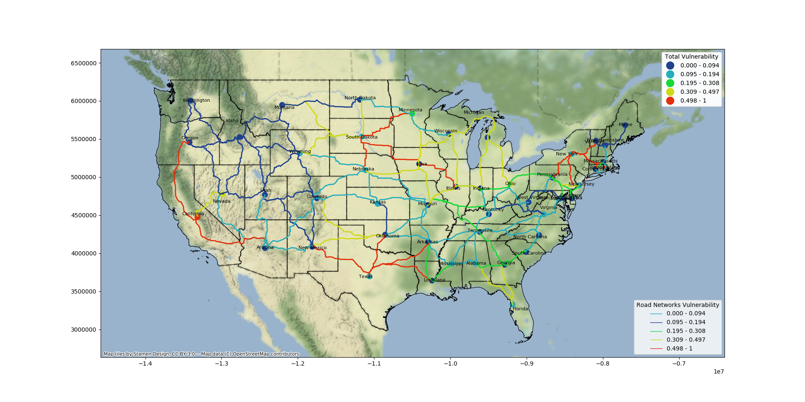
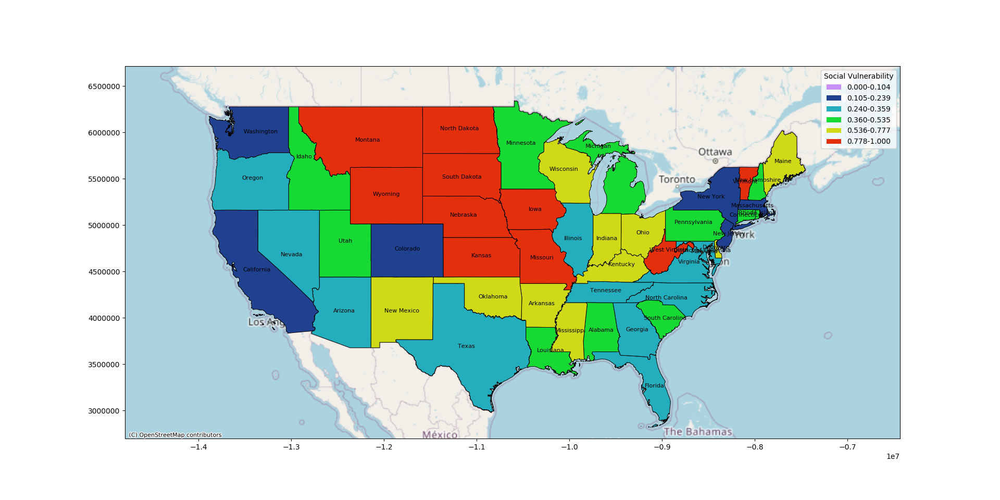
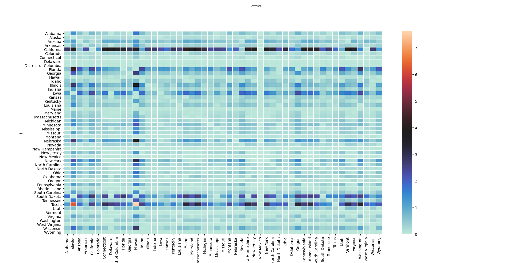

# ML Guided Network Science Based Vulnerability Model
The Covid-19 Pandemic has affected the whole world. As we slowly move towards recovering from this pandemic, we are bound to explore options that can help us effectively restore normalcy. 
<br />We use a LSTM based Time-Series prediction model which accurately predicts the future case counts. This in turn is used to calculate the Health, Social and Total Vulnerability of all the states of the USA. 
<br /> We also calculate travel bubbles or corridors (using the Total vulnerability calculated) that give an insight on which ones are the safest.  

## How to run
It is advised you use a virtual environment for running this model. 

To create a virtual environment using `pip`, In the terminal/cmd type, 
```shell
$ pip install virtualenv
$ virtualenv newenv
$ source newenv/bin/activate
```
To install the required packages or libraries for running the model type, 
```shell
$ pip install -r requirements.txt
```
> You would also need `Rscripts` to run the R files from Python. 

## Using the model
### Important Functions
Here are the list of some important functions
#### Using the LSTM based Prediction Model
1. `set_data(data_loc, data_type)` is used to set tbe data for the prediction model to the specified database. The path of the database is stored in `data_loc` and the `data_type` can take values of the columns of the database ("new_case_count", "case_count", "death_count", etc.)

2. `make_data(stateID)` is used to split the data accquired from the function `set_data()` so that it can be fed into our Deep Learning model

3. `model_compile()` is used to compile the Deep Learning Model
4. `model_train()` is used to train the Deep Learning Model. The model is then saved with the filename *CTST_2LSTM_100_\<stateID>.h5* in the *trained_models* directory. 
5. `predict_3_days()` is used to make prediction for the next three days.
6. `update_csv()` is used to firstly, make the prediction for the next day and update the important .csv files that will be used to calculate different vulnerabilities. 
  
### Using The Vulnerability Calculator
1. `calculate_weights()` is used to run all the R files. The R files perform a DEA analysis and calculate the health vulnerability of each state.
2. `update_json()` is used to update the json files that will be used to plot the necessary vulnerability maps and travel corridors/bubbles. 

### Plotting the results. 
1. `plot_state_social_vul()` is used to plot the Social Vulnerabilities of all the states
2. `plot_state_health_vul()` is used to plot the Health Vulnerabilities of all the states
3. `plot_state_total_vul()` is used to plot the Total Vulnerabilities of all the states 
4. `plot_state_road_vul()` is used to plot the travel corridors for the road networks. This also plots state centroids coloured according to their respective Total Vulnerability. 
5. `plot_air_transport_vul()` is used to plot the travel corridors for the airplane networks. This also plots  airports coloured according to their respective Total Vulnerability at airports.
6. `plot_airport_vul()` is used to plot airports coloured according to their respective Total Vulnerability. 
7. `plot_heatmaps(month)` is used to plot heatmaps representing the vulnerability of different possible flights. 
> NOTE - 6, 7 and 8 do not update after predictions. (Future Work)

### Code Implementation
Below is a code to plot the inter-state travel corridors on the road networks. 
```python
from models import LSTM_Model, Vulnerability_Calculator
from plot import plot_state_road_vul

lstm_model = LSTM_Model(n_steps=7, n_features=1)
# Predict next day value and update the required csv
lstm_model.update_csv()

cal = Vulnerability_Calculator()

# Using R codes calculate files and update the required json files
cal.calculate_weights()
cal.update_json()

# Plotting Road Vulnerabilties
plot_state_road_vul()
```
### Output
The output of the above code is, 


#### Other Outputs
The social vulnerabilities of the state can also be calculated. Shown below is one of the results that we get,


A heatmap for the month of October is generated to demonstrate the severity of flight travels across different airports,

